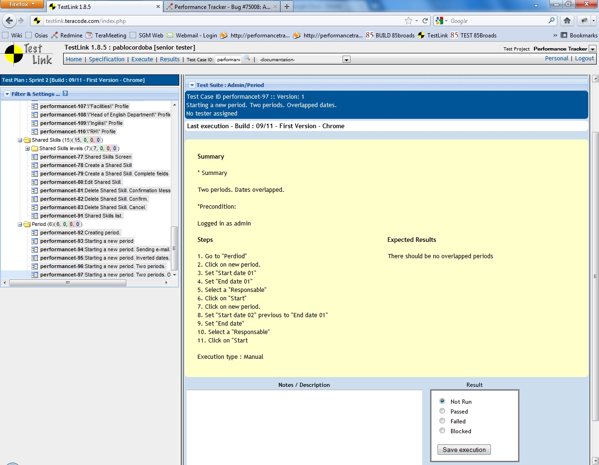

#
Esta diapositiva no sirve de nada...

# Gracias!

`@coffeeworks`
 
`@sgianazza` 

# Preguntas?
 

  (la ausencia de preguntas indica que han entendido todo)
 
 

# Toda la aplicacion automatizada con cucumber 
 

  * 100% de cobertura de negocio
  * Facilidad de automatizacion
  * Comprension exhaustiva del negocio
  * Integracion del equipo
  * Requerimientos claros
 
 

# Es sencillo compartir codigo de negocio con codigo tecnico

  * Comunicacion sencilla y efectiva entre programadores y DP
  * Facil automatizacion del negocio! 

 

~~~~ {.cucumber}
 Feature: Ingreso al sistema
   Como usuario
   quiero ingresar al sistema
   para operar autenticado

   Scenario: Ingreso exitoso
     Given the user is on the home page
     When the user enter her credentials
     Then the admin page should be shown
~~~~

# Forma sencilla de escribir en el lenguaje del negocio

~~~~ {.cucumber}
Feature: Descripcion 
  As an user
  I want to feature 
  in order to business value 

  Scenario: one
    Given ...
    When ...
    Then ...

  Scenario: two 
    Given ...
    And ...
    When ...
    And ...
    Then ...
    And ...

~~~~

# Por que seguimos usando TestLink?

 

# Primero que nada: Cucumber es tan sencillo que podriamos explicarlo de atras hacia adelante

* No requiere aprender nuevas tecnologias
* Solamente se requiere saber un poco de ingles (y ni siquiera esto).
* Entender las bases del negocio es la unica restriccion
* El resto se va descubriendo.

 

# Cucumber: 
 

Bdd que primero habla con el negocio y luego con el codigo
 
 
   

`@coffeeworks`   `@sgianazza`

